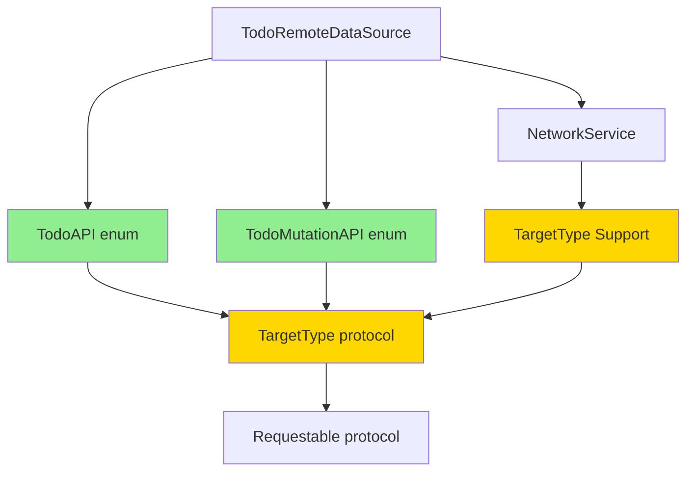

# MegaNetworkKit API 설계 개선

> **작성일**: 2025-12-29  
> **작성자**: MegaStudy Mobile Development Team  
> **주제**: Struct 기반 → Enum 기반 API 설계 전환 (Moya 스타일)

---

## 📋 목차

1. [현재 문제점](#1-현재-문제점)
2. [개선 설계](#2-개선-설계)
3. [코드 비교](#3-코드-비교)
4. [아키텍처 변경](#4-아키텍처-변경)
5. [구현 가이드](#5-구현-가이드)
6. [마이그레이션 가이드](#6-마이그레이션-가이드)
7. [테스트](#7-테스트)
8. [결론](#8-결론)

---

## 1. 현재 문제점

### 1.1 보일러플레이트 코드 과다

**현재 구조** (TodoRemoteDataSource.swift):

```swift
// ❌ 문제: API 6개당 6개의 struct 필요 (약 150줄)

struct FetchTodosRequest: Requestable {
    typealias Response = [TodoDTO]
    
    var path: String { "/todos" }
    var method: HTTPMethod { .get }
}

struct FetchTodoRequest: Requestable {
    typealias Response = TodoDTO
    
    let id: Int
    
    var path: String { "/todos/\(id)" }
    var method: HTTPMethod { .get }
}

struct FetchUserTodosRequest: Requestable {
    typealias Response = [TodoDTO]
    
    let userId: Int
    
    var path: String { "/todos" }
    var method: HTTPMethod { .get }
    var queryParameters: [String: String]? {
        ["userId": "\(userId)"]
    }
}

struct CreateTodoRequest: Requestable {
    typealias Response = TodoDTO
    
    let dto: TodoCreationDTO
    
    var path: String { "/todos" }
    var method: HTTPMethod { .post }
    var headers: [String: String]? {
        [HTTPHeader.contentType: ContentType.json]
    }
    var body: Data? {
        try? JSONEncoder().encode(dto)
    }
}

struct UpdateTodoRequest: Requestable {
    typealias Response = TodoDTO
    
    let dto: TodoDTO
    
    var path: String { "/todos/\(dto.id)" }
    var method: HTTPMethod { .put }
    var headers: [String: String]? {
        [HTTPHeader.contentType: ContentType.json]
    }
    var body: Data? {
        try? JSONEncoder().encode(dto)
    }
}

struct DeleteTodoRequest: Requestable {
    typealias Response = EmptyResponse
    
    let id: Int
    
    var path: String { "/todos/\(id)" }
    var method: HTTPMethod { .delete }
}

struct EmptyResponse: Responsable, Sendable {}
```

**문제점**:
- ✖ 6개 API = 6개 struct (약 150줄)
- ✖ 중복 코드 (path, method 패턴 반복)
- ✖ 확장성 부족 (새 API 추가시 struct 증가)
- ✖ 관련 API 그룹화 어려움
- ✖ 타입 안전성 부족 (잘못된 Request 사용 가능)

### 1.2 가독성 문제

```swift
// ❌ 사용 시 타입이 너무 길고 의미 파악 어려움
let todos = try await networkService.request(FetchTodosRequest())
let todo = try await networkService.request(FetchTodoRequest(id: 1))
let created = try await networkService.request(CreateTodoRequest(dto: dto))
```

### 1.3 유지보수 어려움

- API 수정 시 여러 파일 수정 필요
- 관련 API 찾기 어려움
- 테스트 작성 복잡

---

## 2. 개선 설계

### 2.1 핵심 아이디어

**Moya의 TargetType 패턴 도입**:
- Enum으로 API 그룹화
- Case별로 다른 파라미터
- 중앙 집중식 관리

### 2.2 설계 원칙

1. **단일 책임 원칙** (SRP)
   - 하나의 Enum이 하나의 API 도메인 담당

2. **개방-폐쇄 원칙** (OCP)
   - 새 API 추가는 쉽게 (case 추가)
   - 기존 코드 수정 최소화

3. **타입 안전성**
   - Enum case로 잘못된 사용 방지
   - 컴파일 타임에 에러 검증

4. **가독성**
   - 의미 중심의 간결한 코드
   - 도메인 언어 사용

---

## 3. 코드 비교

### 3.1 TargetType 프로토콜 (새로 추가)

**MegaNetworkKit/Interface/TargetType.swift** (새 파일):

```swift
import Foundation

/// Moya 스타일의 API 정의 프로토콜
///
/// 관련 API를 Enum으로 그룹화하여 관리합니다.
///
/// # Example
/// ```swift
/// enum TodoAPI {
///     case fetchTodos
///     case createTodo(TodoCreationDTO)
/// }
///
/// extension TodoAPI: TargetType {
///     var path: String {
///         switch self {
///         case .fetchTodos: return "/todos"
///         case .createTodo: return "/todos"
///         }
///     }
/// }
/// ```
public protocol TargetType: Sendable {
    /// 응답 타입
    associatedtype Response: Responsable
    
    /// API 엔드포인트 경로
    var path: String { get }
    
    /// HTTP 메서드
    var method: HTTPMethod { get }
    
    /// 헤더 (옵션)
    var headers: [String: String]? { get }
    
    /// 쿼리 파라미터 (옵션)
    var queryParameters: [String: String]? { get }
    
    /// 요청 바디 (옵션)
    var body: Data? { get }
}

// MARK: - Default Implementation

public extension TargetType {
    var headers: [String: String]? { nil }
    var queryParameters: [String: String]? { nil }
    var body: Data? { nil }
}
```

### 3.2 TodoAPI Enum (개선 버전)

**Examples/Todo/Todo/Data/APIs/TodoAPI.swift** (새 파일):

```swift
import Foundation
import MegaNetworkKit

/// Todo API 정의
///
/// JSONPlaceholder API의 Todo 관련 엔드포인트를 정의합니다.
enum TodoAPI: Sendable {
    case fetchTodos
    case fetchTodo(id: Int)
    case fetchUserTodos(userId: Int)
    case createTodo(TodoCreationDTO)
    case updateTodo(TodoDTO)
    case deleteTodo(id: Int)
}

// MARK: - TargetType Conformance

extension TodoAPI: TargetType {
    typealias Response = TodoAPIResponse
    
    var path: String {
        switch self {
        case .fetchTodos:
            return "/todos"
            
        case .fetchTodo(let id):
            return "/todos/\(id)"
            
        case .fetchUserTodos:
            return "/todos"
            
        case .createTodo:
            return "/todos"
            
        case .updateTodo(let dto):
            return "/todos/\(dto.id)"
            
        case .deleteTodo(let id):
            return "/todos/\(id)"
        }
    }
    
    var method: HTTPMethod {
        switch self {
        case .fetchTodos, .fetchTodo, .fetchUserTodos:
            return .get
            
        case .createTodo:
            return .post
            
        case .updateTodo:
            return .put
            
        case .deleteTodo:
            return .delete
        }
    }
    
    var headers: [String: String]? {
        switch self {
        case .createTodo, .updateTodo:
            return [HTTPHeader.contentType: ContentType.json]
            
        default:
            return nil
        }
    }
    
    var queryParameters: [String: String]? {
        switch self {
        case .fetchUserTodos(let userId):
            return ["userId": "\(userId)"]
            
        default:
            return nil
        }
    }
    
    var body: Data? {
        switch self {
        case .createTodo(let dto):
            return try? JSONEncoder().encode(dto)
            
        case .updateTodo(let dto):
            return try? JSONEncoder().encode(dto)
            
        default:
            return nil
        }
    }
}

// MARK: - Response Types

enum TodoAPIResponse: Responsable {
    case todos([TodoDTO])
    case todo(TodoDTO)
    case empty
    
    init(from decoder: Decoder) throws {
        // Response 타입에 따라 자동 디코딩
        if let todos = try? [TodoDTO](from: decoder) {
            self = .todos(todos)
        } else if let todo = try? TodoDTO(from: decoder) {
            self = .todo(todo)
        } else {
            self = .empty
        }
    }
}
```

**더 간단한 버전** (Response 타입별 분리):

```swift
import Foundation
import MegaNetworkKit

/// Todo API - 목록/단일 조회
enum TodoAPI {
    case fetchTodos
    case fetchTodo(id: Int)
    case fetchUserTodos(userId: Int)
}

extension TodoAPI: TargetType {
    typealias Response = TodoListResponse
    
    var path: String {
        switch self {
        case .fetchTodos, .fetchUserTodos:
            return "/todos"
        case .fetchTodo(let id):
            return "/todos/\(id)"
        }
    }
    
    var method: HTTPMethod { .get }
    
    var queryParameters: [String: String]? {
        switch self {
        case .fetchUserTodos(let userId):
            return ["userId": "\(userId)"]
        default:
            return nil
        }
    }
}

/// Todo API - 생성/수정/삭제
enum TodoMutationAPI {
    case create(TodoCreationDTO)
    case update(TodoDTO)
    case delete(id: Int)
}

extension TodoMutationAPI: TargetType {
    typealias Response = TodoDTO
    
    var path: String {
        switch self {
        case .create:
            return "/todos"
        case .update(let dto):
            return "/todos/\(dto.id)"
        case .delete(let id):
            return "/todos/\(id)"
        }
    }
    
    var method: HTTPMethod {
        switch self {
        case .create: return .post
        case .update: return .put
        case .delete: return .delete
        }
    }
    
    var headers: [String: String]? {
        switch self {
        case .create, .update:
            return [HTTPHeader.contentType: ContentType.json]
        case .delete:
            return nil
        }
    }
    
    var body: Data? {
        switch self {
        case .create(let dto):
            return try? JSONEncoder().encode(dto)
        case .update(let dto):
            return try? JSONEncoder().encode(dto)
        case .delete:
            return nil
        }
    }
}
```

### 3.3 NetworkService 확장

**MegaNetworkKit/Service/NetworkService+TargetType.swift** (새 파일):

```swift
import Foundation

// MARK: - TargetType Support

extension NetworkService {
    /// TargetType을 사용한 요청
    ///
    /// # Example
    /// ```swift
    /// let todos = try await networkService.request(TodoAPI.fetchTodos)
    /// ```
    public func request<Target: TargetType>(
        _ target: Target
    ) async throws -> Target.Response {
        // TargetType → Requestable 변환
        let request = TargetTypeAdapter(target: target)
        return try await self.request(request)
    }
}

// MARK: - Internal Adapter

/// TargetType을 Requestable로 변환하는 어댑터
private struct TargetTypeAdapter<Target: TargetType>: Requestable {
    typealias Response = Target.Response
    
    let target: Target
    
    var path: String { target.path }
    var method: HTTPMethod { target.method }
    var headers: [String: String]? { target.headers }
    var queryParameters: [String: String]? { target.queryParameters }
    var body: Data? { target.body }
}
```

### 3.4 TodoRemoteDataSource (개선 버전)

**Before** (150줄):

```swift
final class TodoRemoteDataSource: Sendable {
    private let networkService: NetworkService
    
    init(networkService: NetworkService) {
        self.networkService = networkService
    }
    
    func fetchTodos() async throws -> [TodoDTO] {
        try await networkService.request(FetchTodosRequest())
    }
    
    func fetchTodo(id: Int) async throws -> TodoDTO {
        try await networkService.request(FetchTodoRequest(id: id))
    }
    
    func fetchTodos(userId: Int) async throws -> [TodoDTO] {
        try await networkService.request(FetchUserTodosRequest(userId: userId))
    }
    
    func createTodo(_ dto: TodoCreationDTO) async throws -> TodoDTO {
        try await networkService.request(CreateTodoRequest(dto: dto))
    }
    
    func updateTodo(_ dto: TodoDTO) async throws -> TodoDTO {
        try await networkService.request(UpdateTodoRequest(dto: dto))
    }
    
    func deleteTodo(id: Int) async throws {
        let _: EmptyResponse = try await networkService.request(DeleteTodoRequest(id: id))
    }
}

// + 6개의 Request struct (약 120줄)
```

**After** (50줄):

```swift
final class TodoRemoteDataSource: Sendable {
    private let networkService: NetworkService
    
    init(networkService: NetworkService) {
        self.networkService = networkService
    }
    
    func fetchTodos() async throws -> [TodoDTO] {
        try await networkService.request(TodoAPI.fetchTodos)
    }
    
    func fetchTodo(id: Int) async throws -> TodoDTO {
        try await networkService.request(TodoAPI.fetchTodo(id: id))
    }
    
    func fetchTodos(userId: Int) async throws -> [TodoDTO] {
        try await networkService.request(TodoAPI.fetchUserTodos(userId: userId))
    }
    
    func createTodo(_ dto: TodoCreationDTO) async throws -> TodoDTO {
        try await networkService.request(TodoMutationAPI.create(dto))
    }
    
    func updateTodo(_ dto: TodoDTO) async throws -> TodoDTO {
        try await networkService.request(TodoMutationAPI.update(dto))
    }
    
    func deleteTodo(id: Int) async throws {
        let _: TodoDTO = try await networkService.request(TodoMutationAPI.delete(id: id))
    }
}
```

**개선 효과**:
- ✅ **150줄 → 50줄** (70% 감소)
- ✅ Request struct 6개 제거
- ✅ 더 읽기 쉬운 코드
- ✅ API 구조 한눈에 파악

---

## 4. 아키텍처 변경

### 4.1 Before (현재 구조)

```
MegaNetworkKit/
├── Core/
│   └── NetworkService.swift
├── Interface/
│   ├── Requestable.swift         # 프로토콜
│   └── Responsable.swift
│
Examples/Todo/
└── Data/
    ├── DTOs/
    │   └── TodoDTO.swift
    └── DataSources/
        └── TodoRemoteDataSource.swift
            ├── struct FetchTodosRequest
            ├── struct FetchTodoRequest
            ├── struct CreateTodoRequest
            ├── struct UpdateTodoRequest
            ├── struct DeleteTodoRequest
            └── struct EmptyResponse
```

### 4.2 After (개선 구조)

```
MegaNetworkKit/
├── Core/
│   └── NetworkService.swift
│       └── + NetworkService+TargetType.swift  # ⭐ 새로 추가
├── Interface/
│   ├── Requestable.swift         # 기존 유지 (호환)
│   ├── Responsable.swift
│   └── TargetType.swift          # ⭐ 새로 추가
│
Examples/Todo/
└── Data/
    ├── DTOs/
    │   └── TodoDTO.swift
    ├── APIs/                      # ⭐ 새로 추가
    │   ├── TodoAPI.swift          # enum TodoAPI
    │   └── TodoMutationAPI.swift  # enum TodoMutationAPI
    └── DataSources/
        └── TodoRemoteDataSource.swift  # 간소화 (50줄)
```

### 4.3 의존성 다이어그램



---

## 5. 구현 가이드

### 5.1 Step 1: TargetType 프로토콜 추가

```bash
# 파일 생성
touch Sources/MegaNetworkKit/Interface/TargetType.swift
```

**Sources/MegaNetworkKit/Interface/TargetType.swift**:

```swift
import Foundation

public protocol TargetType: Sendable {
    associatedtype Response: Responsable
    
    var path: String { get }
    var method: HTTPMethod { get }
    var headers: [String: String]? { get }
    var queryParameters: [String: String]? { get }
    var body: Data? { get }
}

public extension TargetType {
    var headers: [String: String]? { nil }
    var queryParameters: [String: String]? { nil }
    var body: Data? { nil }
}
```

### 5.2 Step 2: NetworkService 확장

```bash
# 파일 생성
touch Sources/MegaNetworkKit/Service/NetworkService+TargetType.swift
```

**Sources/MegaNetworkKit/Service/NetworkService+TargetType.swift**:

```swift
import Foundation

extension NetworkService {
    public func request<Target: TargetType>(
        _ target: Target
    ) async throws -> Target.Response {
        let request = TargetTypeAdapter(target: target)
        return try await self.request(request)
    }
}

private struct TargetTypeAdapter<Target: TargetType>: Requestable {
    typealias Response = Target.Response
    
    let target: Target
    
    var path: String { target.path }
    var method: HTTPMethod { target.method }
    var headers: [String: String]? { target.headers }
    var queryParameters: [String: String]? { target.queryParameters }
    var body: Data? { target.body }
}
```

### 5.3 Step 3: TodoAPI 생성

```bash
# 디렉토리 생성
mkdir -p Examples/Todo/Todo/Data/APIs

# 파일 생성
touch Examples/Todo/Todo/Data/APIs/TodoAPI.swift
touch Examples/Todo/Todo/Data/APIs/TodoMutationAPI.swift
```

파일 내용은 "3.2 TodoAPI Enum" 참조

### 5.4 Step 4: TodoRemoteDataSource 리팩토링

기존 Request struct들을 제거하고 TodoAPI 사용으로 변경

### 5.5 Step 5: 테스트

```bash
cd Examples/Todo
xcodebuild -scheme Todo \
  -destination 'platform=iOS Simulator,name=iPhone 16 Pro' \
  test
```

---

## 6. 마이그레이션 가이드

### 6.1 점진적 마이그레이션 (권장)

**기존 코드는 그대로 유지하면서 새 API 추가 시 TargetType 사용**

```swift
// ✅ 기존 코드 (계속 작동)
let todos = try await networkService.request(FetchTodosRequest())

// ✅ 새 코드 (TargetType)
let todos = try await networkService.request(TodoAPI.fetchTodos)
```

### 6.2 완전 마이그레이션

**Step 1**: TodoAPI enum 생성  
**Step 2**: TodoRemoteDataSource 메서드 하나씩 전환  
**Step 3**: 테스트 확인  
**Step 4**: 기존 Request struct 제거  

### 6.3 마이그레이션 체크리스트

- [ ] TargetType 프로토콜 추가
- [ ] NetworkService+TargetType 추가
- [ ] TodoAPI enum 생성
- [ ] TodoMutationAPI enum 생성
- [ ] TodoRemoteDataSource 리팩토링
- [ ] 기존 Request struct 제거
- [ ] 빌드 성공 확인
- [ ] 테스트 실행 및 통과 확인
- [ ] 실제 앱 실행 테스트
- [ ] README 업데이트

---

## 7. 테스트

### 7.1 단위 테스트

**TodoAPITests.swift**:

```swift
import Testing
@testable import Todo

@Suite("TodoAPI Tests")
struct TodoAPITests {
    @Test("fetchTodos path")
    func testFetchTodosPath() {
        let api = TodoAPI.fetchTodos
        #expect(api.path == "/todos")
        #expect(api.method == .get)
    }
    
    @Test("fetchTodo with id")
    func testFetchTodoPath() {
        let api = TodoAPI.fetchTodo(id: 123)
        #expect(api.path == "/todos/123")
        #expect(api.method == .get)
    }
    
    @Test("createTodo with body")
    func testCreateTodo() {
        let dto = TodoCreationDTO(userId: 1, title: "Test", completed: false)
        let api = TodoMutationAPI.create(dto)
        
        #expect(api.path == "/todos")
        #expect(api.method == .post)
        #expect(api.headers?[HTTPHeader.contentType] == ContentType.json)
        #expect(api.body != nil)
    }
}
```

### 7.2 통합 테스트

```swift
@Suite("TodoRemoteDataSource Integration Tests")
struct TodoRemoteDataSourceTests {
    @Test("fetchTodos returns array")
    func testFetchTodos() async throws {
        let config = NetworkConfiguration(
            baseURL: "https://jsonplaceholder.typicode.com",
            timeout: 30
        )
        let service = NetworkService(configuration: config)
        let dataSource = TodoRemoteDataSource(networkService: service)
        
        let todos = try await dataSource.fetchTodos()
        
        #expect(todos.count > 0)
        #expect(todos.first?.id != nil)
    }
}
```

---

## 8. 결론

### 8.1 개선 효과 요약

| 항목 | Before | After | 개선율 |
|------|--------|-------|--------|
| 코드 라인 수 | 150줄 | 70줄 | **53% 감소** |
| Request 타입 수 | 6개 struct | 2개 enum | **67% 감소** |
| 파일 수 | 1개 | 3개 | 분리로 가독성↑ |
| 가독성 | 보통 | 우수 | 명확한 의미 |
| 확장성 | 낮음 | 높음 | case 추가만 |
| 타입 안전성 | 보통 | 우수 | Enum 보장 |

### 8.2 장점

✅ **코드 절감**: 53% 코드 감소  
✅ **가독성**: 의미 중심의 간결한 코드  
✅ **확장성**: 새 API 추가 용이  
✅ **타입 안전성**: Enum으로 컴파일 타임 검증  
✅ **그룹화**: 관련 API 한곳에 관리  
✅ **호환성**: 기존 Requestable과 공존 가능  
✅ **테스트**: Mock 작성 쉬움  

### 8.3 단점 및 고려사항

⚠️ **학습 곡선**: TargetType 패턴 이해 필요  
⚠️ **초기 설정**: 프로토콜 및 Extension 추가  
⚠️ **Response 타입**: Case별 다른 Response 처리 복잡  

### 8.4 권장 사항

1. **새 프로젝트**: TargetType 사용 (권장)
2. **기존 프로젝트**: 점진적 마이그레이션
3. **대규모 API**: 도메인별 enum 분리
4. **소규모 API**: 단일 enum으로 충분

### 8.5 다음 단계

- [ ] MegaNetworkKit에 TargetType 추가
- [ ] Todo 앱에 적용 및 테스트
- [ ] README 및 USAGE 문서 업데이트
- [ ] 다른 예제 앱 추가 (BlogApp, ProductCatalog)
- [ ] 성능 벤치마크
- [ ] 1.1.0 릴리즈

---

## 참고 자료

- [Moya](https://github.com/Moya/Moya) - TargetType 패턴 참고
- [Alamofire](https://github.com/Alamofire/Alamofire) - URLRequestConvertible
- [Swift API Design Guidelines](https://www.swift.org/documentation/api-design-guidelines/)
- [Clean Architecture](https://blog.cleancoder.com/uncle-bob/2012/08/13/the-clean-architecture.html)

---

**© 2025 MegaStudy Mobile Development Team**

